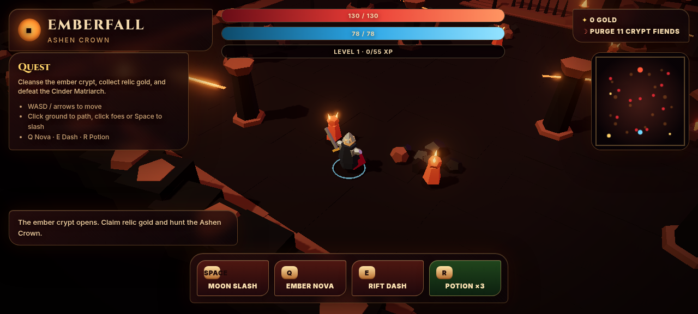

# Emberfall: Ashen Crown



**Emberfall: Ashen Crown** is an original, browser-playable, stylized low-poly isometric action RPG built with **Three.js**, **TypeScript**, and **Vite**.

It is a compact dark-fantasy dungeon crawler in the spirit of classic ARPGs: move through an ember-lit crypt, carve through cultists and beasts, collect relic gold, level up, drink potions, dash through danger, and defeat the **Cinder Matriarch** to shatter the Ashen Crown.

> Originality note: this project is genre-inspired but copyright-safe. It does **not** use Blizzard, Diablo, or Diablo IV names, assets, lore, UI, music, textures, models, or branding. All runtime geometry, materials, names, UI, and effects are original/procedural.

## Live production demo

**Production URL:** https://emberfall-lowpoly-arpg.vercel.app

**GitHub repository:** https://github.com/carlomigueldy/emberfall-lowpoly-arpg

## Highlights

- **Playable low-poly ARPG loop** — move, fight, loot, level up, die, respawn, and win.
- **Original dark-fantasy setting** — an ember crypt, relic gold, ash beasts, and the Cinder Matriarch boss.
- **Warm stylized presentation** — cozy torchlight, soft fog, bloom, ACES tone mapping, procedural stone, rubble, columns, fissures, and hard-silhouette low-poly geometry.
- **Keyboard, mouse, and touch controls** — WASD/arrows, click-to-move, click-to-attack, mobile joystick, and on-screen ability buttons.
- **Combat systems** — melee arc, AoE spell, dash with invulnerability frames, potion healing, floating damage numbers, cooldowns, aggro AI, enemy separation, boss special attack, and per-enemy/boss health UI.
- **Progression systems** — XP, levels, HP/mana growth, gold rewards, relic pickups, loot counters, potion inventory, death penalty, and victory state.
- **Debuggable deterministic QA API** — the browser exposes `window.__EMBERFALL__` for automated gameplay verification.

## Gameplay

You begin at the edge of the Emberfall crypt with a sword, ember magic, three potions, and one objective: purge the crypt fiends and break the Ashen Crown.

The dungeon contains three enemy classes plus a boss:

| Enemy | Role |
|---|---|
| Ember Imp | Fast, fragile swarmer |
| Ash Hound | Aggressive melee pressure |
| Obsidian Brute | Slow, heavy front-liner |
| Cinder Matriarch | Boss with a molten area attack |

The player can defeat enemies for XP and gold, gather relic loot, level up, recover with potions, and eventually challenge the boss. If the player dies, they respawn at the entrance with partial HP and a gold penalty.

## Controls

| Action | Keyboard | Mouse / Touch |
|---|---|---|
| Move | WASD / Arrow keys | Click ground to path · on-screen joystick |
| Sprint | Hold Shift | — |
| Moon Slash | Space | Click a foe · Slash button |
| Ember Nova | Q | Nova button |
| Rift Dash | E | Dash button |
| Potion | R | Potion button |

## Tech stack

- [Three.js](https://threejs.org/) for WebGL rendering, lighting, shadows, and post-processing
- TypeScript with strict checks
- Vite for dev server and production build
- pnpm as the package manager
- Vercel for production hosting

## Run locally

Requirements:

- Node.js 22+
- pnpm 11+

```bash
pnpm install
pnpm run dev
```

Then open:

```txt
http://127.0.0.1:5173
```

If that port is already busy:

```bash
pnpm run dev -- --port 5300 --strictPort
```

## Build

```bash
pnpm run typecheck
pnpm run build
pnpm run preview
```

The production build is emitted to `dist/`.

## Vercel deployment

The repo includes an explicit `vercel.json`:

```json
{
  "framework": "vite",
  "installCommand": "pnpm install --frozen-lockfile",
  "buildCommand": "pnpm run build",
  "outputDirectory": "dist"
}
```

Deploy with:

```bash
pnpm dlx vercel@latest link
pnpm dlx vercel@latest deploy --prod
```

## QA / debug API

For deterministic smoke tests and gameplay verification, the app exposes `window.__EMBERFALL__` in the browser:

```js
__EMBERFALL__.state();              // hp, mana, level, gold, enemiesAlive, bossHp, objective, etc.
__EMBERFALL__.hold('KeyW', true);   // hold or release movement/input keys
__EMBERFALL__.step('KeyS', 30);     // advance the sim deterministically
__EMBERFALL__.cast('attack');       // 'attack' | 'nova' | 'dash' | 'potion'
__EMBERFALL__.teleport(x, z);       // reposition player for tests
__EMBERFALL__.errors;               // buffered runtime errors
```

Append `?smoke=1` to the URL to skip the intro toast during automated tests.

## Verification performed

The project has been verified with real build and browser-runtime checks:

- `pnpm run build` completes successfully.
- The game canvas and HUD render in browser.
- Combat kills enemies and grants XP/gold.
- Boss HP can be reduced to zero and the victory objective triggers.
- Death/respawn flow works.
- Dash movement and invulnerability frames work.
- Runtime debug error buffer remains empty during smoke checks.

## Project structure

```txt
.
├── docs/
│   └── emberfall-screenshot.png
├── src/
│   ├── main.ts       # renderer, world, combat, AI, HUD, QA API
│   └── style.css     # responsive HUD, mobile controls, visual styling
├── index.html
├── package.json
├── pnpm-lock.yaml
├── tsconfig.json
├── vercel.json
└── README.md
```

## License

No open-source license has been selected yet. The source is public for viewing, but reuse rights are not granted unless a license is added later.
